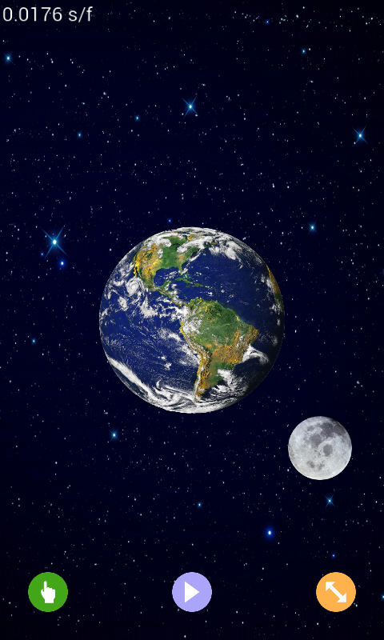
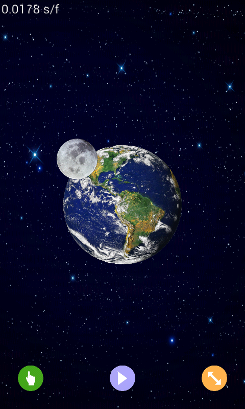
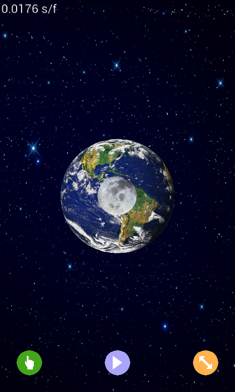

OpenGLES2DDemo
==============

OpenGLES 2.0 2D Sprite Demo

Demo renders and animates 2D sprites using OpenGLES 2.0.   
Written in <b>Java</b> using Android Studio 2.1.2 and tested on Android 2.3.3 and 5.1.1 devices.

    

There are 3 buttons on the bottom of the screen that control speed, play/pause and direction of moon sprite. 
The 3 buttons are also animated.

I added frame rate smoothing code from https://github.com/fadden/android-breakout.

I added the GLText class from https://github.com/d3alek/Texample2 to display frame rate text.
